# LiLo (Public) 
Public repository for the LiLo (Ladder In Ladder Out) Mobile Application.

## Overview
LiLo helps facilitate advanced leverage cryptocurrency trading on the ByBit exchange. As an alternative to the ByBit mobile and Web applications, LiLo provides quick and efficient ordering with the added benefit of laddered contract orders.

### Features
- Real-time market information. Including positive and negative price change highlighting, market 24hr price highs and lows, 1hr and 24hr percentage changes along with trading volume.
- Real-time currency charting from [TradingView](https://uk.tradingview.com/).
- Simplified currency ordering.
- Easily use the last price in order creation.
- Easily generate ladder orders between the start and end price for a given number of 'rungs', linearly applied for a contract quantity.
- Quickly review and edit any orders
- Receive automatic notifications of application updates for easy updates.

## Supported Platforms: Android, iOS, and Windows

The LiLo app is currently available for these platforms:

| Platform | Install | Build Status |
| -------- | ------- | ------------ |
| Android  | [Alpha](https://tinyurl.com/LiLoApp) |  |
| iOS      | N/A        | N/A       |
| UWP      | [Alpha](https://install.appcenter.ms/users/george-internetwideworld.com/apps/LiLo-2/releases/)        |  |

Both the iOS and UWP (Universal Windows Platform) versions are currently work-in-progress as we concentrate on the Android release.

## Social
If you want to get in contact with us on social platforms, you can reach us on .  *No personal information* is collected by the application, as such we do not know who you are, so please get in touch and let us know what you think about LiLo.

## Reporting bugs
We use GitHub issues  to track issues.  Feedback with improvements and raising of issues will be highly appreciated and accepted.

## Screens
NOTE: All of the screen shots are subject to change as the application evolves.

### Markets view
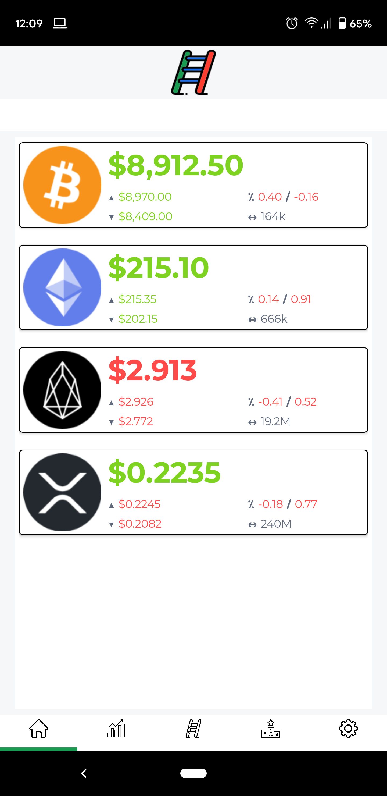  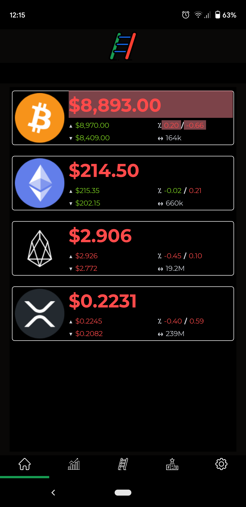

### Chart view
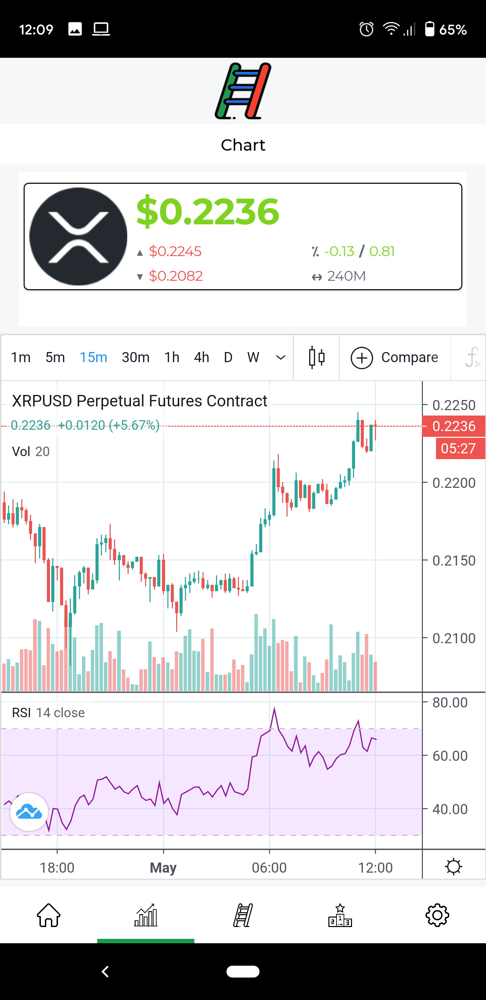

### Order view
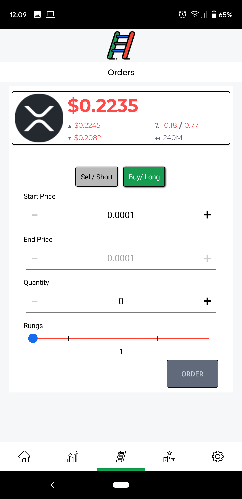 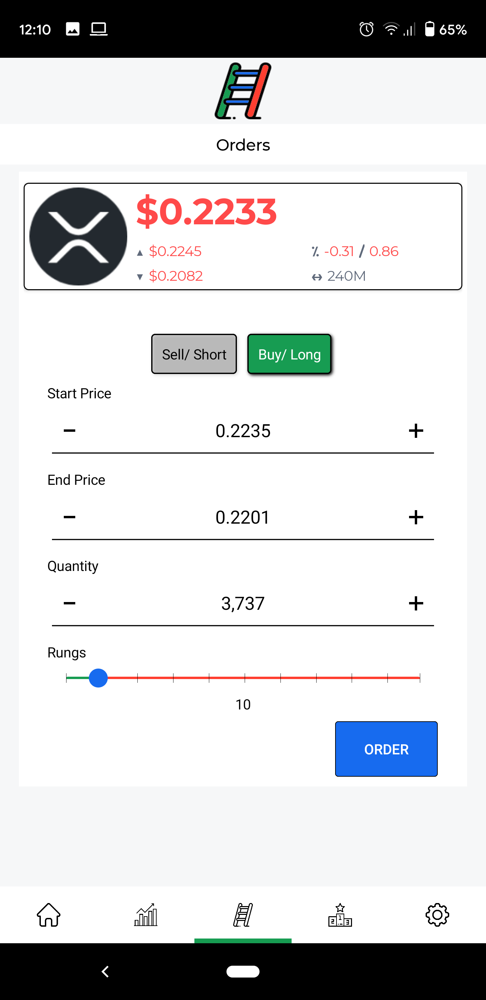 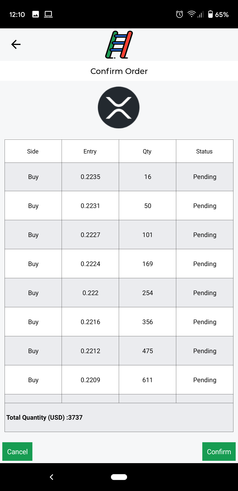 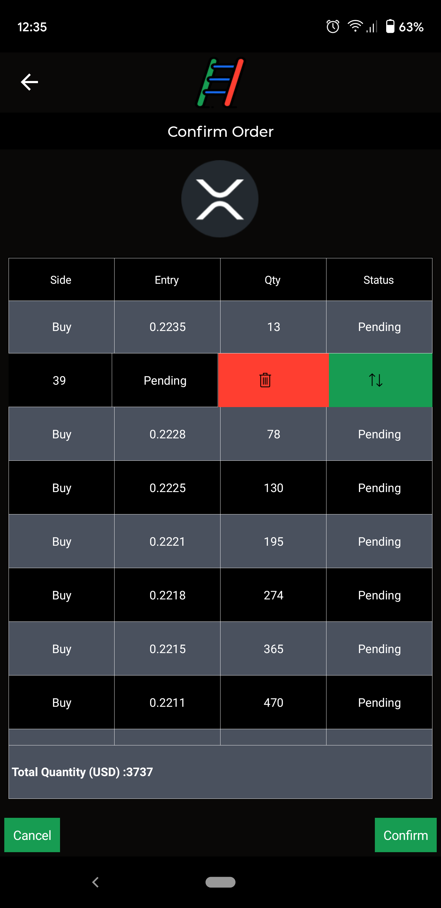

### Position view
...to be implemented...

### Settings view
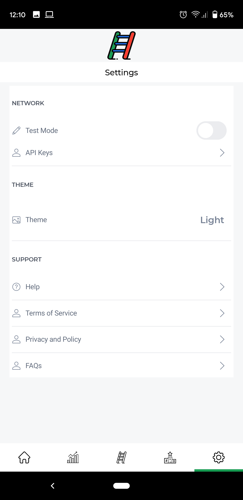 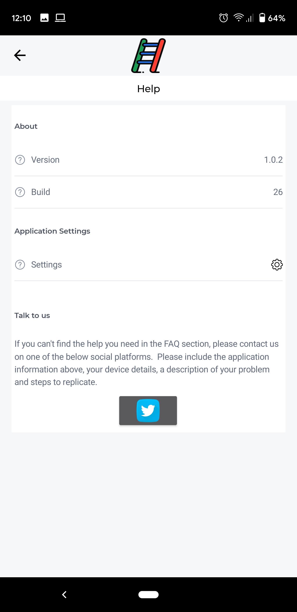

### Update notification (automatic)
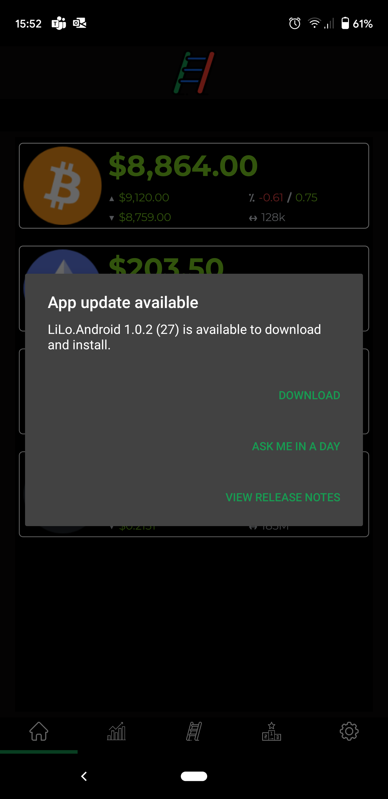 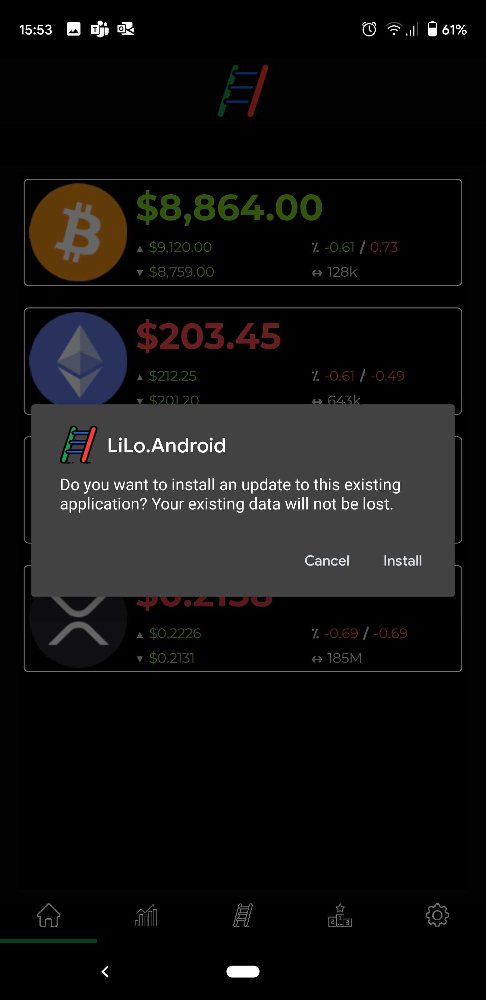

## DISCLAIMER

** IMPORTANT:** LiLo is currently in an **ALPHA** state. We are working toward making the application ready for production release. As such, you use the application **at your own risk**.  Many areas of the application may not be available, and functionality will be subject to change.

It is highly recommended that you test the LiLo application and your trading ideas on TestNet/Developer network, before risking real currencies on MainNet.
**You** are responsible for keeping your API key(s) safe. If you suspect that your key(s) have been compromised, it is your responsibility to immediately remove them and generate new keys on the ByBit network.
LiLo depends on services provided by ByBit for operation.  LiLo operates on the provision of these services and operates on a **BEST EFFORTS** basis.

## ByBit integration
The LiLo application integrates with the ByBit service.  The LiLo application does not require that you obtain API key(s) from ByBit to operate, but to place orders (single or ladder), you need API key(s) on the appropriate network.
It is highly recommended that you test the LiLo application and your trading ideas on TestNet/Developer network, before risking real currencies on MainNet.

All the exchange services provided by ByBit can be found on [ByBit.com](https://www.bybit.com/).  Please give them your support, and if there are any issues not specifically related to LiLo, please engage them directly.

### Getting Your API Key and Secret Key

> For TestNet
https://testnet.bybit.com/user/api-management

> For MainNet
https://www.bybit.com/app/user/api-management