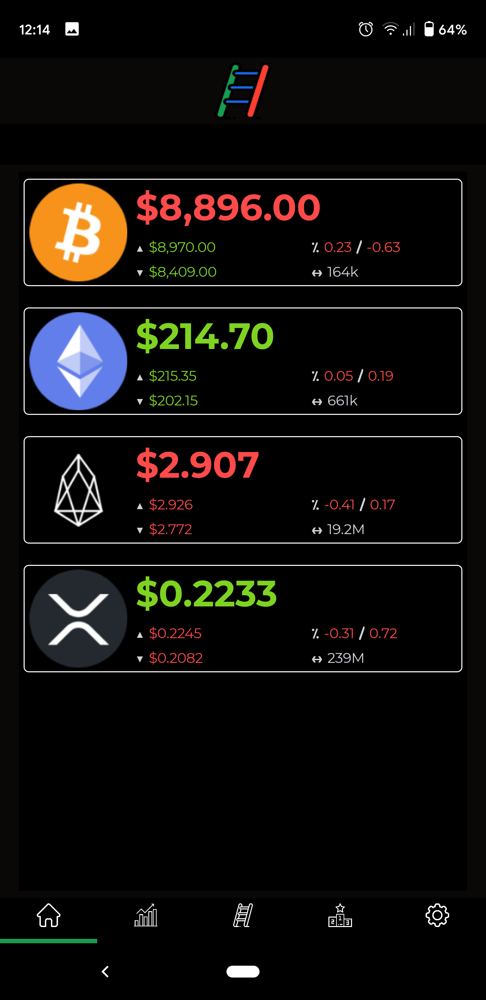

# LiLo (Public) 
Public repository for the LiLo (Ladder In Ladder Out) Mobile Application.

## Overview
The purpose of LiLo is to provide an alternative to the ByBit mobile and Web applications, and to add additional features that they do not (currently) provide.  One of the main features we aim to provide is the ability to automate the casting of order ladders.

## Supported Platforms: Android, iOS and Windows

The LiLo app is currently available for these platforms:

| Platform | Install | Build Status |
| -------- | ------- | ------------ |
| Android  | [Alpha](https://tinyurl.com/LiLoApp) |  |
| iOS      | N/A        | N/A       |
| UWP      | N/A        | N/A       |

Both the iOS and UWP (Universal Windows Platform) versions are currently work-in-progress as we concentrate on the Android release.

## Screens
  
 
     

  

### DISCLAIMER

** IMPORTANT:** The current state of this application is **ALPHA**, because we are currently still working on the application, making it ready for production release.  Therefore, you use the application **at your own risk***.  Many areas of the application may not be available and functionality will be subject to change.  Feedback with improvements and raising of issues from the user base will be highly appreciated and accepted.
It is highly recommended that you test the LiLo application and your trading ideas on TestNet/Developer network, before risking real currencies on MainNet.
**You** are responsible for keeping your API key(s) safe. If you suspect that your key(s) have been compromised, it is your responsibility to immediately remove them and generate new keys on the ByBit network.
LiLo depends on services provided by ByBit for operation.  LiLo operates on the provision of these services and operates on a **BEST EFFORTS** basis.

## ByBit integration
The LiLo application integrates with the ByBit service.  The LiLo application does not require that you obtain API key(s) from ByBit to operate, but in order to place orders (single or ladder), you need API key(s) on the appropriate network.
It is highly recommended that you test the LiLo application and your trading ideas on TestNet/Developer network, before risking real currencies on MainNet.
### Getting Your API Key and Secret Key

> For Testnet
https://testnet.bybit.com/user/api-management

> For Mainnet
https://www.bybit.com/app/user/api-management

##NEWS / ANNOUNCEMENTS
Full release notes for each release of the application can be found on the install page, as listed in the "Supported Platforms" section.

Feedback with improvements and raising of issues from the user base will be highly appreciated and accepted.